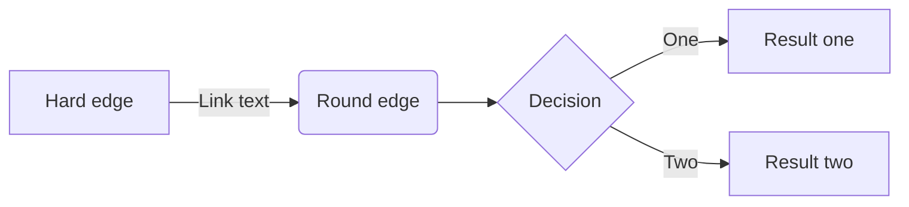
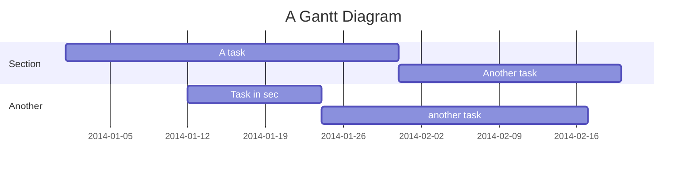

# Tutorial Intro

Let's discover **Docusaurus in less than 5 minutes**.

## Getting Started

Get started by **creating a new site**.

Or **try Docusaurus immediately** with **[new.docusaurus.io](https://new.docusaurus.io)**.

## Generate a new site

Generate a new Docusaurus site using the **classic template**:

Let $f:[a,b] \to \R$ be Riemann integrable. Let $F:[a,b]\to\R$ be $F(x)=
\int_{a}^{x}f(t)dt$. Then $$F$$ is continuous, and at all $x$ such that $f$ is continuous at $x$, $F$ is differentiable at $x$ with $F'(x)=f(x)$.

$$
I = \int_0^{2\pi} \sin(x) dx
$$


```shell
npx @docusaurus/init@latest init my-website classic
```

```plantuml
class XX {
    + Interger yy
}
```
<br/>

<div class="mermaid">
  graph LR
    Start --> Stop
</div>







## Start your site

Run the development server:

```shell
cd my-website

npx docusaurus start
```

Your site starts at `http://localhost:3000`.

Open `docs/intro.md` and edit some lines: the site **reloads automatically** and display your changes.
